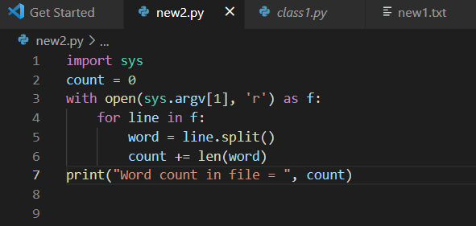
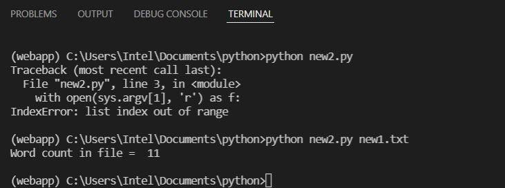

# command-line-arguments-to-count-word
## AIM:
To write a python program for getting the word count from the contents of a file using command line arguments.
## EQUIPEMENT'S REQUIRED: 
PC
Anaconda - Python 3.7
## ALGORITHM: 

Start Program

### Step 1:
Create two files with extension .py and .txt

### Step 2: 
Import sys in the file with .py extension
 
### Step 3: 
Give some input words in the file with .txt extension

### Step 4:  
Save the files

### Step 5: 
Open terminal

### Step 6:
Run the program and get the output

### step 7:
End Program

## PROGRAM:
~~~
Program Developed by : Sarankumar J
Reference number: 21500780
To write a python program for getting the word count from the contents of a file using command line arguments.
import sys
count = 0
with open(sys.argv[1], 'r') as f:
    for line in f:
        word = line.split()
        count += len(word)
print("Word count in file = ", count) 

~~~

### OUTPUT:

## RESULT:
Thus the program is written to find the word count from the contents of a file using command line arguments.
